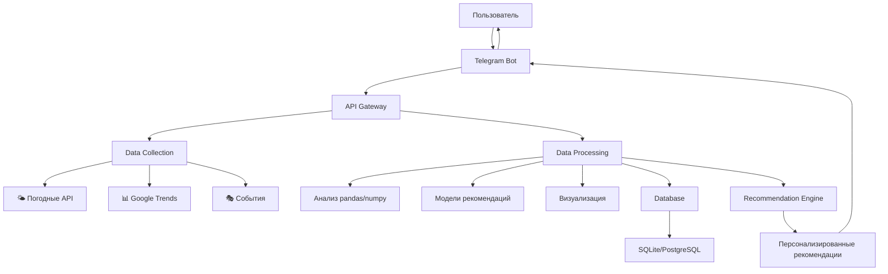

# 🗺️ TripPlanner — Умный планировщик путешествий

<div align="center">


**Интеллектуальная система для оптимального планирования поездок**

[🚀 Быстрый старт](#-быстрый-старт) • [📊 Возможности](#-возможности) • [🛠️ Технологии](#-технологический-стек) • [🤖 Использование](#-использование)

</div>

## 🌟 О проекте

**TripPlanner** — это интеллектуальный помощник, который анализирует множество факторов для рекомендации **идеального времени** для вашего путешествия. Система объединяет анализ погодных условий, сезонной загруженности и туристических трендов, предоставляя персонализированные рекомендации через удобного Telegram-бота.

> 🎯 **Цель проекта**: Упростить планирование путешествий, избавив пользователей от необходимости самостоятельно анализировать десятки факторов при выборе дат поездки.

---

## 📊 Ключевые возможности

### 🎯 Умный анализ
- **🌤️ Погодные условия** — исторические данные и прогнозы
- **👥 Сезонная загруженность** — анализ туристического потока
- **📅 Оптимальные даты** — автоматический подбор лучшего времени для посещения
- **🎭 События и фестивали** — учет культурных мероприятий

### 🤖 Удобный интерфейс
- **Telegram-бот** — доступ к рекомендациям в любимом мессенджере
- **Персонализация** — учет предпочтений пользователя
- **Визуализация** — графики и диаграммы для наглядности
- **Сравнение** — возможность сравнить несколько городов

### 📈 Data-driven подход
- **Актуальные данные** — ежедневное обновление информации
- **Несколько источников** — агрегация данных из проверенных API
- **Алгоритмический анализ** — объективные рекомендации на основе данных
- **Постоянное обучение** — улучшение рекомендаций со временем

---

## 🎯 Пример работы

<div align="center">

### ✨ Пример рекомендации для Казани

```text
🚀 ВАШ ПЕРСОНАЛЬНЫЙ ПЛАН ДЛЯ ПОЕЗДКИ В КАЗАНЬ
━━━━━━━━━━━━━━━━━━━━━━━━━━━━━━━━━━━━━━━

🎯 ЛУЧШЕЕ ВРЕМЯ: Третья неделя мая

📊 ОБОСНОВАНИЕ:
✅ Погода: Средняя температура +18°C, всего 2 дождливых дня
✅ Загруженность: Туристов на 40% меньше, чем в пик сезона (июль)
✅ Комфорт: Идеальные условия для прогулок и экскурсий

🏆 АЛЬТЕРНАТИВНЫЕ ВАРИАНТЫ:
2. Сентябрь — "Бабье лето", золотая осень, меньше туристов
3. Начало июня — тепло, но еще не жарко, природа в цвету

📈 ГРАФИК СЕЗОННОСТИ: [показать график]
```

</div>

---

## 🏗️ Архитектура проекта



### 📁 Структура проекта
```
tripoptimizer/
├── 📂 src/
│   ├── 📂 data_collection/     # Сбор данных
│   │   ├── weather/           # Погодные API
│   │   ├── trends/            # Google Trends
│   │   └── events/            # События и фестивали
│   ├── 📂 data_processing/    # Обработка
│   │   ├── analysis/          # Аналитика
│   │   ├── models/            # ML модели
│   │   └── visualization/     # Графики
│   ├── 📂 telegram_bot/       # Бот
│   │   ├── handlers/          # Обработчики
│   │   ├── keyboards/         # Кнопки
│   │   └── messages/          # Шаблоны
│   └── 📂 utils/              # Утилиты
├── 📂 config/                 # Конфигурация
├── 📂 tests/                  # Тесты
├── 📂 docs/                   # Документация
├── 📜 requirements.txt        # Зависимости
├── 📜 .env.example            # Шаблон .env
└── 📜 main.py                 # Точка входа
```

---

## 🛠️ Технологический стек

<div align="center">

### 🐍 Основные технологии
| Технология | Назначение | Версия |
|------------|------------|---------|
| **Python** | Основной язык | 3.10+ |
| **pandas** | Анализ данных | 2.0+ |
| **numpy** | Численные вычисления | 1.24+ |
| **SQLAlchemy** | Работа с БД | 2.0+ |
| **python-telegram-bot** | Telegram API | 20.0+ |
| **matplotlib** | Визуализация | 3.7+ |
| **requests** | HTTP запросы | 2.31+ |

### 🌐 Источники данных
| Источник | Тип данных | Доступ |
|----------|------------|---------|
| **Open-Meteo** | Прогноз погоды | Free API |
| **WorldWeatherOnline** | История погоды | Free Tier |
| **Google Trends** | Популярность | Dataset |
| **Туристические порталы** | События, цены | Парсинг |

</div>

---

## 🚀 Быстрый старт

### 📋 Предварительные требования
- Python 3.10 или новее
- Аккаунт Telegram
- API ключи (бесплатные)

### 🔧 Установка за 5 минут

```bash
# 1. Клонируйте репозиторий
git clone https://github.com/yourusername/tripoptimizer.git
cd tripoptimizer

# 2. Создайте виртуальное окружение
python -m venv venv

# Активация (Linux/Mac)
source venv/bin/activate

# Активация (Windows)
venv\Scripts\activate

# 3. Установите зависимости
pip install -r requirements.txt

# 4. Настройте конфигурацию
cp config/.env.example .env
# Отредактируйте .env файл, добавив свои ключи

# 5. Запустите бота
python src/main.py
```

### ⚙️ Конфигурация

Создайте файл `.env` в корне проекта:

```env
# 🔐 Telegram Bot
TELEGRAM_BOT_TOKEN=your_bot_token_here

# 🌤️ Погодные API
OPEN_METEO_URL=https://api.open-meteo.com/v1
WORLD_WEATHER_API_KEY=your_api_key_here

# 💾 База данных
DATABASE_URL=sqlite:///data/tripoptimizer.db

# ⚙️ Настройки
LOG_LEVEL=INFO
CACHE_DURATION=3600
SUPPORTED_CITIES=kazan,moscow,saint_petersburg,sochi
```

---

## 🤖 Использование

### 🎮 Работа с Telegram-ботом

1. **Найдите бота**: [@TripOptimizerBot](https://t.me/TripOptimizerBot)
2. **Начните диалог**: Команда `/start`
3. **Выберите город**: Команда `/city Казань`
4. **Получите рекомендации**: Автоматический анализ

### 📝 Доступные команды

| Команда | Описание | Пример |
|---------|----------|---------|
| `/start` | Начало работы | `/start` |
| `/help` | Помощь и инструкции | `/help` |
| `/city <название>` | Рекомендации для города | `/city Казань` |
| `/compare <город1> <город2>` | Сравнение городов | `/compare Москва Санкт-Петербург` |
| `/preferences` | Настройки предпочтений | `/preferences` |
| `/history` | История запросов | `/history` |
| `/feedback` | Отправить отзыв | `/feedback` |

### 🎛️ Настройка предпочтений

```text
🎛️ НАСТРОЙКИ ПРЕДПОЧТЕНИЙ

🌡️ Предпочитаемая температура:
☑️ Прохладно (10-18°C)
✅ Комфортно (18-25°C) ← выбрано
☑️ Тепло (25-30°C)

👥 Отношение к толпе:
✅ Избегать скоплений
☑️ Нейтрально
☑️ Не важно

💧 Отношение к дождю:
✅ Сухая погода
☑️ Нейтрально
☑️ Не важно
```

---

## 📊 Методология анализа

### 🔍 Сбор данных
```python
# Пример сбора данных
class DataCollector:
    def get_weather_data(self, city, period):
        """Сбор погодных данных"""
        # Историческая погода + прогноз
        
    def get_popularity_data(self, city):
        """Анализ популярности"""
        # Google Trends + туристическая статистика
        
    def get_events_data(self, city, month):
        """События и фестивали"""
        # Календарь мероприятий
```

### 🧮 Оценка оптимальности

```
ОЦЕНОЧНАЯ ФУНКЦИЯ:
Оптимальность = (W1 × Температурный_комфорт) 
              + (W2 × Отсутствие_осадков) 
              + (W3 × Низкая_загруженность) 
              + (W4 × Наличие_событий)

Где:
• W1, W2, W3, W4 — веса пользовательских предпочтений
• Все факторы нормированы от 0 до 1
```

### 📈 Визуализация результатов

```
СЕЗОННОСТЬ КАЗАНИ (2024)
┌────────────────────────────────────────┐
│ Янв Фев Мар Апр Май Июн Июл Авг Сен Окт│
│░░░░░░░░░░░░░░░░░░░░░░░░░░░░░░░░░░░░░░░░│
│░░░░░░░░░░░░░░▒▒▒▒▒▓▓▓▓▓▓▒▒▒▒▒░░░░░░░░░░│ ← Загруженность
│░░░░░░░░░░░░░░░░░░░░░░░░░░░░░░░░░░░░░░░░│
│░░░█░░░░░░░░█░░░░░░░░░░░░░░░░█░░░░░░░░░░│ ← Лучшие периоды
└────────────────────────────────────────┘
```

---

## 🤝 Участие в разработке

Мы рады вкладу в развитие проекта! Вот как вы можете помочь:

### 🐛 Сообщить об ошибке
1. Проверьте [существующие Issues](https://github.com/yourusername/tripoptimizer/issues)
2. Создайте новое Issue с детальным описанием

### 💡 Предложить улучшение
1. Обсудите идею в Issues перед реализацией
2. Создайте Pull Request с изменениями

### 🔧 Процесс разработки

```bash
# 1. Форкните репозиторий
# 2. Клонируйте свой форк
git clone https://github.com/yourusername/tripoptimizer.git

# 3. Создайте ветку для фичи
git checkout -b feature/amazing-feature

# 4. Внесите изменения и закоммитьте
git add .
git commit -m "Добавил потрясающую фичу"

# 5. Запушьте изменения
git push origin feature/amazing-feature

# 6. Создайте Pull Request
```

### 📋 Требования к коду
- Соблюдение PEP 8
- Документация для новых функций
- Тесты для новой функциональности
- Обновление README при необходимости

---

## 📈 Дорожная карта

### 🎯 Ближайшие цели (Q2 2024)
- [ ] Поддержка 50+ городов России
- [ ] Интеграция с сервисами бронирования
- [ ] Мобильное приложение (MVP)
- [ ] Система уведомлений
- [ ] Расширенная аналитика

### 🚀 Среднесрочные планы (Q3-Q4 2024)
- [ ] Международные направления
- [ ] AI-рекомендации (ML модели)
- [ ] Социальные функции
- [ ] API для разработчиков
- [ ] Плагины для браузеров

### 🌍 Долгосрочное видение (2025+)
- [ ] Глобальное покрытие
- [ ] Интеграция с календарями
- [ ] Голосовой помощник
- [ ] AR/VR возможности
- [ ] Партнерская программа

---

## 📄 Лицензия

Этот проект распространяется под лицензией **MIT**. Подробнее см. в файле [LICENSE](LICENSE).

```
MIT License

Copyright (c) 2024 TripOptimizer Team

Разрешается свободное использование, копирование, изменение, объединение, публикация, 
распространение, сублицензирование и/или продажа копий программного обеспечения.
```

---

## 👥 Команда проекта

<div align="center">

| Роль | Участник | Контакты |
|------|----------|----------|
| **Project Lead** | Иван Иванов | [@ivan_ivanov](https://t.me/ivan_ivanov) |
| **Backend Developer** | Анна Смирнова | [@anna_smirnova](https://t.me/anna_smirnova) |
| **Data Scientist** | Михаил Петров | [@mikhail_petrov](https://t.me/mikhail_petrov) |
| **Frontend Developer** | Екатерина Сидорова | [@ekaterina_sidorova](https://t.me/ekaterina_sidorova) |

</div>

## 🙏 Благодарности

Благодарим следующие сервисы за предоставление бесплатных API и данных:

- [Open-Meteo](https://open-meteo.com/) за точные прогнозы погоды
- [WorldWeatherOnline](https://www.worldweatheronline.com/) за исторические данные
- [Google Trends](https://trends.google.com/) за данные о популярности
- Всех контрибьюторов и тестировщиков проекта

## 📞 Контакты и поддержка

<div align="center">

### 🌐 Официальные каналы
| Канал | Ссылка | Описание |
|-------|--------|----------|
| **Бот в Telegram** | [@TripOptimizerBot](https://t.me/TripOptimizerBot) | Основной бот |
| **Чат поддержки** | [@TripOptimizerChat](https://t.me/TripOptimizerChat) | Вопросы и помощь |
| **GitHub Issues** | [Issues](https://github.com/yourusername/tripoptimizer/issues) | Баги и предложения |
| **Email** | support@tripoptimizer.ru | Деловая переписка |

### 📊 Статистика проекта


</div>

---

<div align="center">

## ⭐ Поддержите проект

Если проект вам понравился, поставьте **звезду** на GitHub — это помогает проекту развиваться!

[](https://github.com/yourusername/tripoptimizer)

**Путешествуйте умнее с TripOptimizer!** ✈️🌍✨

</div>
